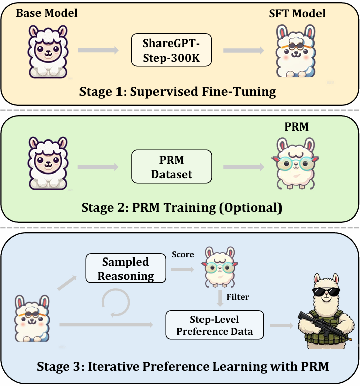

<div align="center">

<h1>Unveiling Chain of Step Reasoning for Vision-Language Models with Fine-grained Rewards</h1>

[Honghao Chen](https://scholar.google.com.hk/citations?user=j_yFqlsAAAAJ&hl=zh-CN)<sup>1,2,3#</sup>, [Xingzhou Lou](https://scholar.google.com.hk/citations?hl=zh-CN&user=vqrGnsQAAAAJ)<sup>1,2#</sup>, [Xiaokun Feng](https://scholar.google.com.hk/citations?hl=zh-CN&user=NqXtIPIAAAAJ)<sup>1,2#</sup>, [Kaiqi Huang](https://scholar.google.com.hk/citations?hl=zh-CN&user=caQ-OmYAAAAJ)<sup>1,2</sup>, [Xinlong Wang](https://scholar.google.com/citations?hl=zh-CN&user=DPz0DjYAAAAJ&view_op=list_works&sortby=pubdate/)<sup>3</sup>

<sup>1</sup>[CASIA](http://english.ia.cas.cn/), <sup>2</sup>[UCAS](https://english.ucas.ac.cn/), <sup>3</sup>[BAAI](https://www.baai.ac.cn/english.html)<br><sup>#</sup> Equal Contribution <br>
[[`Paper`](https://arxiv.org/pdf/2509.19003v1)] 
<p align="center">
  
</p>

</div>

In this work, we introduce **C**hain **o**f **S**tep reasoning for vision-language models, enabling assessing reasoning step quality accurately and leading to effective reinforcement learning and inference-time scaling with fine-grained rewards. Experimental results across multiple benchmarks demonstrate the effectiveness of CoS. More importantly, we conduct extensive empirical analysis and ablations to unveil CoS’s appealing properties. We hope this paper offers insights into more complex multi-modal reasoning.


## ToDo List 

- [x] SFT Dataset
- [ ] PRM & Dataset
- [ ] Training & Inference code
- [ ] Checkpoints

We are going to release the above components in the coming two weeks!

## ShareGPT-Step-300K

***Note***: You can directly use our SFT dataset (special tokens have been added) through the following link, or you can assess the raw step data to customize your SFT dataset.

|                              | Description                           | Links                                                        |
| ---------------------------- | ------------------------------------- | ------------------------------------------------------------ |
| **ShareGPT-Step-300K.jsonl** | The SFT Jsonl                         | [🤗 HF link]([ShareGPT-Step-300K.jsonl · Lauch1ng/CoS-Dataset at main](https://huggingface.co/datasets/Lauch1ng/CoS-Dataset/blob/main/ShareGPT-Step-300K.jsonl)) |
| **images.zip**               | image files                           | [🤗 HF link](https://huggingface.co/datasets/Lauch1ng/CoS-Dataset/blob/main/images.zip) |
| **raw_jsonl.zip**            | raw step jsonl file for customization | [🤗 HF link]([raw_jsonl.zip · Lauch1ng/CoS-Dataset at main](https://huggingface.co/datasets/Lauch1ng/CoS-Dataset/blob/main/raw_jsonl.zip)) |


## License

[Apache License 2.0](LICENSE)

## Citation

```
@article{chen2025unveiling,
  title={Unveiling Chain of Step Reasoning for Vision-Language Models with Fine-grained Rewards},
  author={Chen, Honghao and Lou, Xingzhou and Feng, Xiaokun and Huang, Kaiqi and Wang, Xinlong},
  journal={arXiv preprint arXiv:2509.19003},
  year={2025}
}
```


